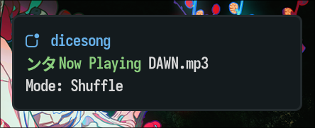

# Dunst Dotfiles

Dunst notification daemon configuration for a Hyprland environment.

## Preview




## Folder Contents

- `dunstrc` - Dunst configuration (layout, urgency colors, click actions, font, and icon behavior).
- `install.sh` - Arch-based installer script.
- `uninstall.sh` - Arch-based uninstaller script.
- `dunst1.png` - preview screenshot.
- `dunst2.png` - preview screenshot.

## Features

- Top-right notification placement with custom spacing and rounded borders.
- Custom rich-text format for app name, summary, and body.
- Uniform timeout profile for low, normal, and critical urgency.
- Mouse actions for close current, run action, and close all.
- Notification history support and rofi-based history menu command.

## Dependencies

Minimum:

- `dunst`
- `libnotify` (`notify-send`)
- Nerd Font (example: `Iosevka Nerd Font`)

Optional (used by this config):

- `rofi` (for `dmenu = rofi -dmenu -p dunst:`)
- `xdg-utils` (`xdg-open` browser action)
- `papirus-icon-theme` (or any icon theme you prefer)

## Installation

```bash
mkdir -p ~/.config/dunst
cp Dunst/dunstrc ~/.config/dunst/dunstrc
```

## Quick Customization

- Update `font` and urgency colors in `dunstrc`.
- If your username is different, adjust absolute paths in `dunstrc` (`ExecStart` and `icon_path`) to match your system.
- If you do not use `rofi`, replace the `dmenu` command in `dunstrc`.
