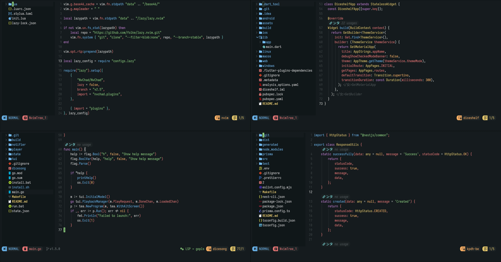

# Neovim Dotfiles

Neovim configuration based on NvChad with Lazy.nvim plugin manager.



## Folder Contents

- `init.lua` - Main Neovim entry point, plugin manager setup and initialization.
- `lazy-lock.json` - Locked versions of all plugins for reproducible setup.
- `.luarc.json` - Lua language server configuration for better IDE support in Neovim config.
- `.stylua.toml` - Code formatter configuration for Lua files.
- `lua/` - Configuration modules:
  - `options.lua` - Vim options and settings.
  - `mappings.lua` - Custom key mappings.
  - `autocmds.lua` - Automatic commands.
  - `configs/` - Plugin-specific configurations.
  - `plugins/` - Custom plugin definitions.

## Features

- NvChad v2.5 base configuration with treesitter, LSP, and DAP support.
- Plugin management with Lazy.nvim.
- Git integration (gitsigns).
- Code formatting (conform).
- Symbol outline support.
- Custom key mappings optimized for productivity.
- Discord rich presence (neocord plugin).
- Flutter development tools.
- Tree-sitter based syntax highlighting and code navigation.

## Dependencies

Minimum:

- `neovim` (v0.9 or higher)
- `git` (for plugin management)

Optional (used by plugins):

- `npm` (for LSP servers and tools)
- `node` (for LSP servers)
- `python` (for some LSP servers)
- `golang` (for gopls if developing Go)
- `rust` (for rust-analyzer if developing Rust)
- `gdu` or `du` (for disk usage in some utilities)
- Nerd Font (example: `JetBrainsMono Nerd Font`) for icons

LSP Servers (installed via Mason):

- `lua-language-server`
- `bash-language-server`
- `json-lsp`
- and others configured in `lua/configs/lspconfig.lua`

## Installation

```bash
mkdir -p ~/.config/nvim
cp -r Neovim/init.lua ~/.config/nvim/
cp -r Neovim/lua ~/.config/nvim/
cp -r Neovim/.luarc.json ~/.config/nvim/
cp -r Neovim/.stylua.toml ~/.config/nvim/
cp -r Neovim/lazy-lock.json ~/.config/nvim/
```

Or use the automated script (Arch-based distros only):

```bash
bash Neovim/install.sh
```

This script will:

- check whether `neovim` is already installed,
- install `neovim` if it is missing,
- back up existing config to `~/.config/nvim.backup-<timestamp>` (if present),
- deploy the latest configuration files,
- install lazy.nvim and plugins on first startup.

## First Run

After installation, open Neovim and it will automatically:

1. Download and install lazy.nvim if not present.
2. Install all plugins listed in the configuration.
3. Install Mason packages and LSP servers.

This may take a few minutes on the first run.

## Uninstall

Use the following script to uninstall:

```bash
bash Neovim/uninstall.sh
```

The uninstall script will:

- check `neovim` installation status,
- remove config files deployed by the script,
- optionally remove the `neovim` package via `pacman -Rns` if installed.

## Quick Customization

- Add new plugins in `lua/plugins/init.lua`.
- Customize key mappings in `lua/mappings.lua`.
- Adjust editor behavior in `lua/options.lua`.
- Enable/disable specific plugins by modifying `lua/plugins/` files.
- Configure LSP servers in `lua/configs/lspconfig.lua`.
- Change theme by modifying the base46 configuration in your chadrc.

## Troubleshooting

If plugins don't load correctly:

1. Clear the cache: `:Lazy clear` in Neovim.
2. Update plugins: `:Lazy update` in Neovim.
3. Check for errors: `:Lazy` to open the dashboard.

If LSP servers fail to install:

1. Open Mason: `:Mason` in Neovim.
2. Manually install language servers via Mason.
3. Ensure required build tools are installed (npm, python, etc.).
