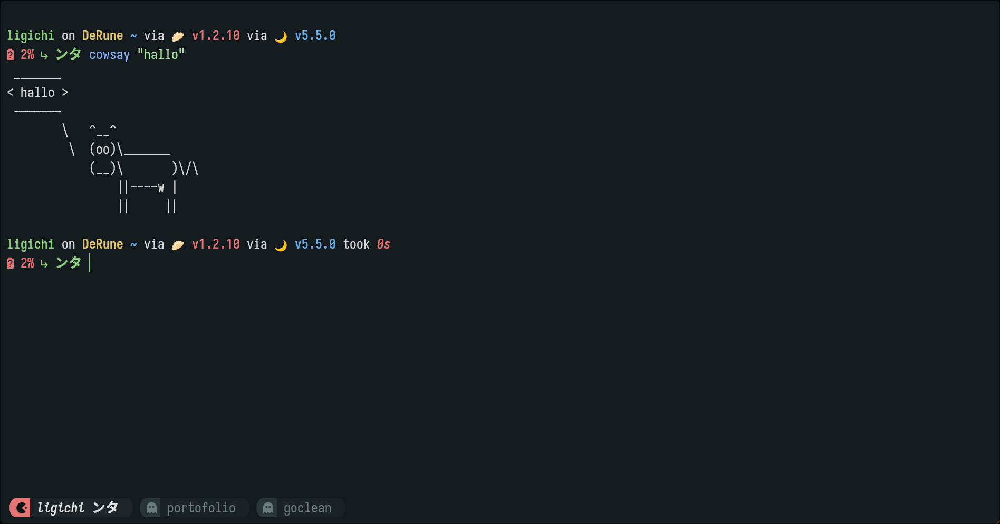

# Dotfiles

This repository contains my personal Linux desktop dotfiles and configuration files.

## Repository Structure

- `Waybar/` - Waybar configuration for Hyprland. Full details are in `Waybar/README.md`.
- `Dunst/` - Dunst notification configuration for Hyprland. Full details are in `Dunst/README.md`.
- `Starship/` - Starship prompt configuration. Full details are in `Starship/README.md`.
- `Neovim/` - Neovim nvchad Configuration. Full details are in `Neovim/README.MD`
- `Fish/` - Fish shell configuration. Full details are in `Fish/README.md`
- `Nwgbar/` - Nwgbar configuration. Full details are in `Nwgbar/README.md`
- `Kitty/` - Kitty terminal configuration. Full details are in `Kitty/README.md`
- `Hyprland/` - Hyprland hyprlang and lua configuration. Full details are in `Hyprland/README.md`

## Preview
### Waybar

### Dunst

### Neovim

### Kitty

## Usage

1. Clone this repository.
2. Enter the component folder you want to use.
3. Follow the instructions in that folder's `README.md`.
